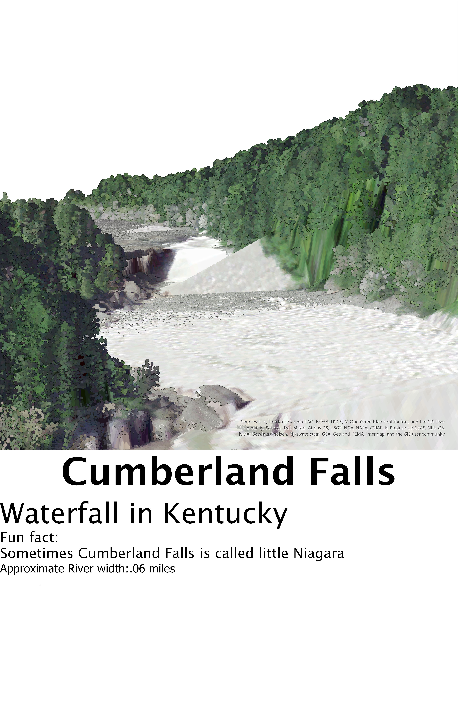
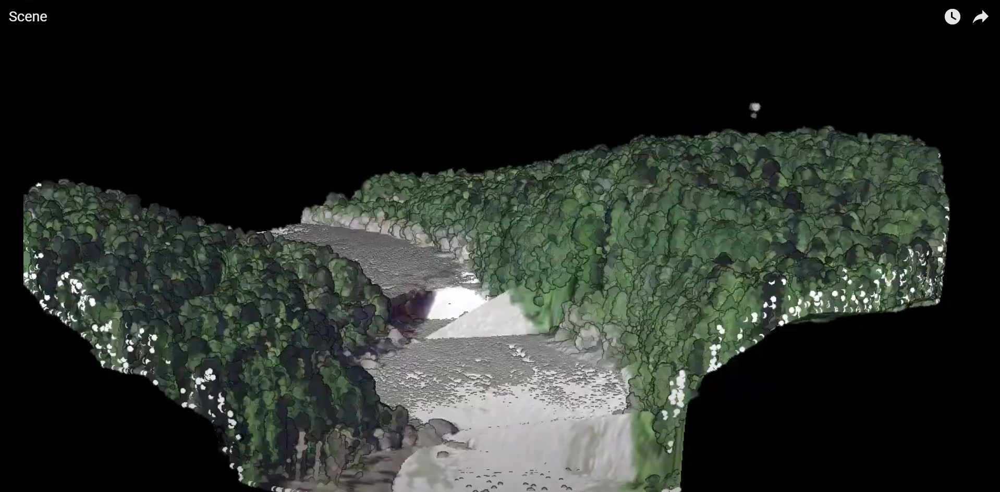

# Cumberland Falls Point Cloud and Animation

### Cumberland Falls, sometimes called the Little Niagara, the Niagara of the South, or the Great Falls, is a waterfall on the Cumberland River in southeastern Kentucky.

  _Cumberland Falls_

 _[Flythrough animation](https://youtu.be/noViZBiYFp)_

